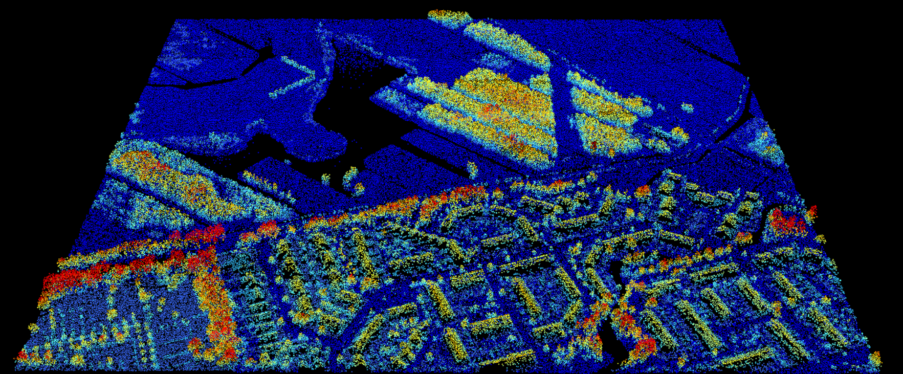
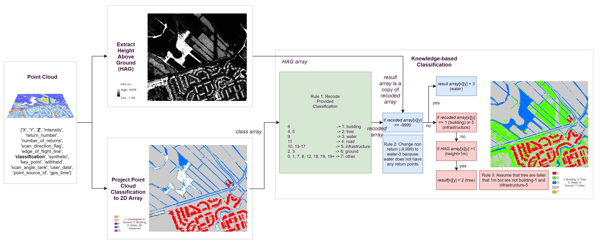
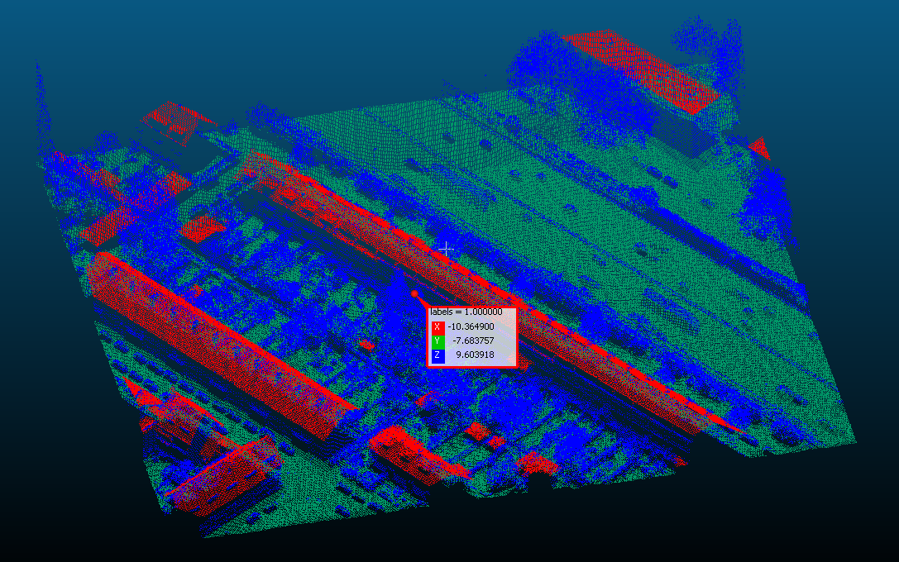
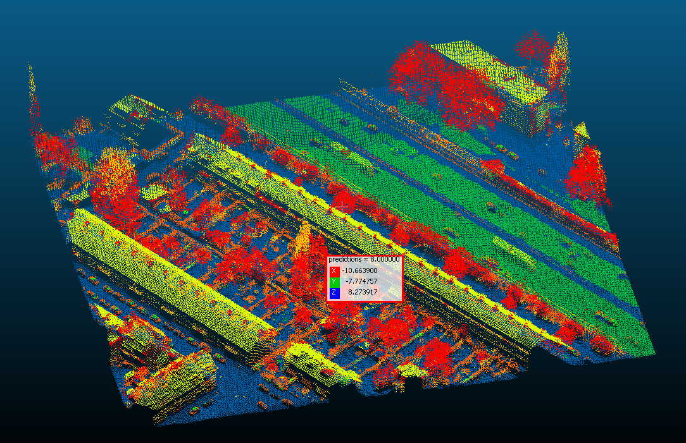

# LiDAR Feature Extraction
This is an implementation to use Python and other open-source tools to develop a reproducible solution to extract meaningful features (e.g., buildings, trees, water, etc.) from ONLY LiDAR data.



# Goals
* Identifying meaningful features buildings, trees, water, and so forth
* Well-organized and self-explanatory document
* Clean and well-tested code

# Constraints 
* Only LiDAR data is available (including 5 built-in classes: Unassigned = 1, Ground = 2, Building = 6, Water = 9, Reserved = 19 and plus)
* Within 7 days
* Solution needs to be completely open-source

# Solutions
The essential objective of this project is to classify the geographic features using LiDAR point cloud. Regardless of the constraints, a throughout solution exploration was conducted to (1) understand the current status of this field and what solutions that both the academic and industry have developed and (2) decide what may be the way to improve from there both from the perspective of data and methodology. The following are the solutions starting from the most intuitive way such as the knowledge-based solutions, to the more advanced machine learning (ML) point classification solutions. Other potential solutions such as point convolutional neural network (CNN) and similar methods were also explored and considered. So far, only one and a half solutions were implemented due to the limited time. More solutions are planned to be explored and implemented.

It is worth noting that a quantitative evaluation was not conducted which is needed to be conducted as the next step.

## 1. Knowledge-based Solution (Available)
LiDAR point cloud indeed provides accuracy and high-resolution x-, y-, and z-coordinates surface information of objects. Additionally, the provided point cloud files include "intensity", "return number", "number of returns", "scan direction flag", "edge of flight line", "classification", "synthetic", "key point", "withheld", "scan angle rank", "user data", "point source id", and "gps time" variables. However, it lacks visual information, which is significant for tasks such as feature extraction and classification.

One of the biggest constraints of the project is that LiDAR is the only available data. The knowledge-based solution is an intuitive and easy-to-implement solution to quickly extract meaningful features from the data. The method can be implemented after experimentally exploring the data. I come across a similar idea from a 2015 article written by my former colleague and supervisor (Drs. Jason Parent and Daniel Civco) ["A fully-automated approach to land cover mapping with airborne LiDAR and high-resolution multispectral imagery in a forested suburban landscape"](https://www.sciencedirect.com/science/article/abs/pii/S092427161500057X). They used a knowledge-based solution to efficiently and accurately extract landscape features.  

As a result, a simplified version of the knowledge-based solution was chosen and developed to extract features. The workflow pictures below show how the point data was processed and eventually turned into a 2D classification result. The result can be reproduced using [knowledgebased-lidar2feature.ipynb](knowledgebased-lidar2feature.ipynb).



The workflow of the the knowledge-based solution consists of the following steps:

(1) Convert point data to classification array based on the provided classification information.

(2) Calculate the height above ground (HAG) from point data in order to differentiate trees from buildings and other infrastructures.

(3) Knowledge-based feature extraction.

This part include three components: (1) recode the classes; (2) extract water; and (3) identify trees as shown below.

* **Recode the classes** based on the provided classification information.
```
  |  *** Provided Classes ***   |    | *** Targeted Classes  |
  | 6                           | -> |  1: building          |
  | 4, 5                        | -> |  2: tree              |
  | 9                           | -> |  3: water             |
  | 11                          | -> |  4: road              |
  | 10, 13-17                   | -> |  5: infrastructure    |
  | 2, 3                        | -> |  6: ground            |
  | 0, 1, 7, 8, 12, 18, 19, 19+ | -> |  7: other             |
```

* **Extract water**: Change non-return (-9,999) to water-3 because water does not have any return points.

* **Identify trees**: Differentiate trees from buildings and other infrastructures by assuming that trees are taller than 1 m but were not originally classified as building-1 and infrastructure-5.

(4) Remove noise using a majority filter.

A majority filter was developed and used to reduce salt-and-pepper effects.

## 2. Machine Learning-based Solution (Experimental)
Machine learning (ML) was considered as a next to-try solution to achieve the goals given the recent advancement. Supervised ML models appear to be more suitable in this kind of application but they usually require a proper model and large amount of quality labeled data. As same as other conventional prototyping procedures, I started by looking for available and reproducible methods. 

I found a pre-defined characteristics point cloud classification method. It calculates seven point-characteristics (i.e., "height above ground", "planarity", "sphericity", "verticality", "anisotropy", "surface variation", and "intensity") and then used labeled point cloud with the derived seven point-characteristics to train an Bidirectional Long Short-Term Memory (BiLSTM) model. As a result, the trained model can be used to classify new points. However, most of the ML applications were conducted in computer science and computer vision fields. The available codes were not meant to work with LiDAR data in `.las` or `.laz` format. **Therefore, a data adapter was developed to experiment with the feasibility of the model in this project. Besides that, other related codes were acquired from [aerial_pc_classification](https://github.com/theobdt/aerial_pc_classification) project to experiment this potential solution.** It was briefly tested and appeared to be a possible solution. All the files in `configs` folder and `external.py` were acquired from the same project except for the needed code integration and consolidation.

The trained model performs well in differentiating tree points from other types of features. However, I could not complete converting the resulting points in `.ply` format to a proper scale and correct coordinates in a raster format. The following two pictures show the before- and after- classification using the provided data. The result can be reproduced using [mlbased-lidar2feature.ipynb](mlbased-lidar2feature.ipynb). 

The picture below is a 3D visualization of the provided data where tree points (appear to be BLUE) are "unassigned."



The picture below shows the predicted results of the provided data. Most of the tree points (which appear to be RED) were correctly identified and extracted.



## 3. Improved ML-based Solution (To-do)
As a next step, it is to further improve the possible solutions to achieve the best results. There are a few apparent drawbacks of the ML-based solution presented above. For example, it only considered the seven **pre-defined** derived characteristics. Furthermore, different than CNN, BiLSTM is a sequence processing model which is designed to make predictions given sequences of data. Additionally, it trained only one small labeled dataset covering a small area.

To overcome the drawbacks above, the next logical improvements are to (1) explore the use of CNN-based models such as PointCNN, PointNet, PointNet++, and others that were designed to exploit "spatial correlation" in data. Using the CNN-based models can choose the best "characteristics" for us instead of the seven pre-defined ones; (2) develop a data adapter module to easily convert data formats for public labeled benchmark and `.las/laz` data since there are a lot of labeled data but are not in `.las/laz` format; and (3) establish a data processing pipeline to streamline the process for production. 

## 4. Optical Image and LiDAR Fusion ML-based End-to-end Solution (To-do)
As mentioned in the beginning, there are limitations to use LiDAR data alone. Therefore, it is worth exploring other data options in addition to using better models such as widely available optical imagery (including aerial imagery and street-level views). 


# Getting Started
The easiest way to explore this repository is to run the following two notebooks.
* [knowledgebased-lidar2feature.ipynb](knowledgebased-lidar2feature.ipynb) This notebook shows how the knowledge-based solution extracts features from cloud point file step by step. It also visualized the final results.
* [mlbased-lidar2feature.ipynb](mlbased-lidar2feature.ipynb) This notebook shows how to do extract features using the experimental ML-based solution.

## File Structure
```
gischallenge/
 ├──data/                                          # store the to-process data
 |  ├──knowledgebase/C_37EZ1_7415_sample.las       # sample data for the demo of kownledge-based solution
 |  └──mlbase/C_37EZ2_7415_sample.las              # sample data for the demo of ML-based solution 
 ├──download/                                      # store downloaded data
 ├──configs/                                       # config files for trained model, model and characteristics extraction parameters (from third party)
 |  ├──trained_model/                              
 |  ├──config_bilstm.yaml                          
 |  └──config_characteristics_extraction.yaml      
 ├──lidar2feature/                                 
 |  ├──external.py                                 # supportive code for the ML-based solution (from third party)
 |  ├──knowledgebased.py                           # knowledge-based classification implementation
 |  ├──mlbase.py                                   # ML-based classification implementation place holder
 |  └──utils.py                                    # commonly used small functions
 ├──pictures/                                      # pictures that used in this README.md
 ├──conda-requirements.txt                         # conda environment setup file
 ├──download-data.sh                               # linux script to download data
 ├──knowledgebased-lidar2feature.ipynb             # demo notebook for the knowledge-based solution
 ├──mlbased-lidar2feature.ipynb                    # demo notebook for the ML-based solution
 ├──pip-requirements.txt                           # pip environment setup file
 ├──README.md                                      # repo description
 └──setup-env.sh                                   # linux script to setup environment
```


# Setup
This project requires open-source tools/packages. They were managed by Conda and pip. The following is how to clone the repository, set up the necessary environment, download data, and preprocess the point cloud data. 

## Requirements
### Operating System (OS)
This repository works on both Windows and Linux OS but the easy setup scripts including `setup-env.sh` and `download-data.sh` only work on Linux.

### Software
Conda and Git are required to setup the environment. 
* [Conda](https://docs.conda.io/projects/conda/en/latest/index.html)
* [Git](https://git-scm.com/)

## Clone Repository
open a terminal and follow the commands below to download the entire repository:
```
git clone https://github.com/Weixing-Zhang/gischallenge.git
cd gischallenge
```

## Create Conda Environment
* `Linux`: It is needed to create a Conda environment. Please remember to replace `<env>` with your preferred conda environment name:
```
 ./setup-env.sh <env>
```
* `Windows`: Execute the following commands to install the environment and replace `<env>` with your preferred conda environment name:
```
conda create -n <env> -y --channel conda-forge
conda activate <env>
conda install --file conda-requirements.txt -y --channel conda-forge
pip install -r pip-requirements.txt
```

## Download the LiDAR `.laz` Files
You can download two large LiDAR data by following the instructions below. Two sample LiDAR datasets [C_37EZ1_7415_sample.las](data/knowledgebase/C_37EZ1_7415_sample.las) and [C_37EZ2_7415_sample.las](data/mlbase/C_37EZ2_7415_sample.las) are provided in the `data` folder.
* `Linux`: Follow the commands below to download LiDAR data to the `./download` folder:
```
./download-data.sh
```
* `Windows`: Click the following [C_37EZ1.LAZ](https://download.pdok.nl/rws/ahn3/v1_0/laz/C_37EZ1.LAZ) and [C_37EZ2.LAZ](https://download.pdok.nl/rws/ahn3/v1_0/laz/C_37EZ2.LAZ) to directly downloand them.


# Preprocess Large LiDAR Data (Optional)
## Decompress the `.laz` to `.las` Files 
Some software and tools may not work with `.laz` files. To decompress them, you can use [LAStools](https://rapidlasso.com/lastools/), [PDAL](https://pdal.io/), and others out there. 

I prefer using LAStools because it supports command-line scripting. Please note that LAStools scripting ONLY works on `Windows` machines. You need to [download the LASTools](https://lastools.github.io/download/LAStools.zip), unzip it, and add `LAStools/bin` to the system path and run the following command lines with absolute paths such as:
```
cd download
las2las -i C_37EZ1.LAZ -epsg 28992 -o C_37EZ1_7415.las 
```

* `-i`: input file; `-o`: output file.
* EPSG code 7415, which was provided by the challenge document, is for a composite CRS of 28992 and 5709. The EPSG code 28992 for the horizontal CRS is  "Amersfoort / RD New" and the EPSG code 5709 is for the vertical datum.

## Break Large `.las` Files into Smaller Tiles
The `.las` files potentially have a very large number of points so they are needed to be broken down into smaller tiles. The following is how this can be done using LAStools but this solution only works on `Windows` machines as mentioned before.
```
lastile -i C_37EZ1_7415.las -tile_size 500 -buffer 10 -odir tiles_500 -o C_37EZ1_7415_tile.las
```

* `-tile_size`: the size of smaller tile; `-buffer`: the overlapping distance; `-odir`: the output folder that will store the tiles.


# Explore the solutions using provided notebooks
Finally, you can launch the notebooks [knowledgebased-lidar2feature.ipynb](knowledgebased-lidar2feature.ipynb) and [mlbased-lidar2feature.ipynb](mlbased-lidar2feature.ipynb) to see how to reproduce the results and scale up the processing for a large amount of data.


# Knowledgement
One and a half feature extraction solutions were provided in this repository. It is worth noting that a significant part of the second solution was from [Aerial point cloud classification](https://github.com/theobdt/aerial_pc_classification) project. That includes the model training, characteristics computation, and final prediction.
